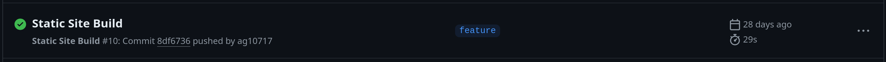
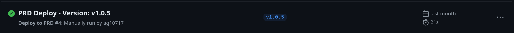

# Github Actions

Document focussing some thoughts on the presentation that was given on Github Actions and the way that we use them in comparison the longer used Azure DevOps Pipelines.

> NOTE: Headers will break down the talking points in order as given as in the presentation.

## Pipeline Focus

**Timestamp: 16 minutes**

**Statement**: Taking a snap shot of a run from the trigger of a git action (push, pull request, tag, etc...) and comparing them between Azure DevOps and Github Actions makes the assumption that the previous state (Azure DevOps) was correct.

**Rebutal**: *This should not be the way that you are determining that you are using a new "technology" correctly.*

---

**Statement**: You should evaluate the new AND old platform in conjunction with each other against a pattern that you think will ultimately benefit others and improve the experience. If we take the focuses of commit, workflow/stage, branch as a collective and determine what is more important for us to see, then you can evaluate which platform is more fit for purpose.

**Rebutal**: *For example if when a developer opens either Github or Azure DevOps, the first thing they want to know is which version of an application is deployed in which environment, that should be the focus.*

---

**Statement**: In the case of these CI/CD platforms, the whole screen needs to be evaluated for that case and whether a new pattern can accomodate that outcome.

**Rebutal**: *A "workflow" is still present in Azure DevOps, it's just wrapped into a single line item (and more widely the current "pipeline"s page you are in) and it more prevently shows the stages within that at first glance. Github actions lists the worflows on the left hand navigation item instead.*

## Focussing on the Workflow

**Timestamp: 16 minutes 50 seconds**

**Statement**: "Why should we be focussing on the workflows listed in Github Actions?"

**Rebutal**: *You should be focussing on the workflow because this should be the set of actions to perform your desired outcome. Your outcome, application being built, should be determining the view and in turn ensuring that workflows are presented with concise names; ie: **Build & Test***

---

**Statement**: For example you should provide workflows that produce the outcome of "Build & Test" (these could potentially be split into their own workflows depending on any complex actions that might need to be performed and whether they can or should be performed independently of one another.)

**Rebutal**: *You should present the clear outcomes for your development lifecycle and in most cases for our solutions it would likely be: **Build -> Test -> Deploy to N***

*The **Branch**/**Tag**/**PR** then becomes the second determining factor for quick information because now you know most of the valuable information upfront*:

* *"In **Build & Test** -> My branch `feature-1` -> " = We know that changes that I have made to my code have triggered **Build & Test***
* *"In **Deploy to N** -> Tag `v1.0.0` -> " = We know that features in tag `v1.0.0` have deployed to **N** environment.*

**Example**:




## Filtering Workflows

**Timestamp: 17 minutes 15 seconds**

**Statement**: "We don't care about the workflow name" (mainly when filtering workflows)

**Rebutal**: *As with [Focussing on the Worflow](#focussing-on-the-workflow), the workflow name is the most important key because the default view when opening the "Actions" tab in Github is "All Workflows". We can then use the 2 items we know about from above, **Workflow Name** and **Triggering Source**, without having to go into each workflow separately.*

> NOTE: **Workflow Name** = `Build & Test` | `Deploy-To-DEV`; **Triggering Source** = `v1.0.0` | `main`

## What Next?

**Timestamp: 17 minutes 20 seconds**

*Covering some base information about the similarities between Azure DevOps and Github Actions*

**Question**: In the concept of Github Actions: "What are Workflows?"

**Answer**: *Workflows are the triggering point of a new run and a grouping of actions (and jobs) to perform a set outcome. Workflows are also broken up into the base/triggering workflow and [Re-useable Workflows](https://docs.github.com/en/actions/using-workflows/reusing-workflows).*

---

**Question**: In the concept of Github Actions: "What are Jobs?"

**Answer**: *Jobs are a grouping of jobs to perform specific tasks; ie: setup npm -> download & install packages -> build application*

---

**Question**: In the concept of Github Actions: "What are Actions?"

**Answer**: *Actions are executing functions that peform a single task; ie: a shell script to execute*

## Current Github Action Design

**Timestamp: 18 minutes 15 seconds**

**Statement**: "We have logic to check what branch made the trigger and how many attempts have been made on that trigger."

**Rebutal**: *Yes. The branch check is also a control that exists in Azure DevOps and it is the controlling factor for NOT deploying changes to all environments (which we have defined as a "Stage" in that pipeline) on an approved **PR**.*

*It is important to note why the `run_attempt` condition exists, that is to mimic Azure DevOps "manual" release control (a user clicking retry). Github Actions does not have the concept of being able to manually request a **Job**, although they can be re-run.*

*Changing the deployment workflows would solve the `run_attempt` usage.*

## Better Github Action Design

**Timestamp: 18 minutes 40 seconds**

**Statement**: Using the parameters that currently exist in Azure DevOps to determine the improved pattern when using Github Actions (see [Pipeline Focus](#pipeline-focus))

**Rebutal**: *Parameters defined at the top of a pipeline file should be not be the sole determining factor of what outcome you want to achieve. The parameters exist as a way to pass user controlled settings like the idea behind "skipping tests". Environmental controls should either be done by approving workflows or manually being reqested by a user/developer.*

---

**Statement**: Taking the example from the video - "I want to do a `DEV - Quick Deploy`", this should be the first Red Flag that parameters are being used wrong.

**Rebutal**: *If other approaches were made that always controlled the release to DEV and not all environments. Then all pushes to a Feature branch, for example, could trigger a release to DEV. If Github Actions was always the platform of choice going forward you can use the features it provides to make that possible; ie: `workflow_run` triggers - see [Events that Trigger Workflows](https://docs.github.com/en/actions/using-workflows/events-that-trigger-workflows#workflow_run)*

> NOTE: *It's also worth noting that in Azure DevOps, not having something run to all "Stages" is controlled by the `environment` configuration housed outside of each defined pipeline.*

> NOTE: *Don't forget that the same controls for **if branch == main** exists in the Azure DevOps pipelines currently*

*If we used the provided screenshot samples [above](#focussing-on-the-workflow) we could use the workflow `deploy-to-dev` and target a specific tag (which was already built when I pushed to my branch) and it would deploy just as quickly. With the added benefit that we don't have to rebuild on every new pipeline trigger.*

---

**Timestamp: 19 minutes 25 seconds**

**Statement**: "This (Build and Deploy for BFF) workflow only runs when you push to a branch."

**Rebutal**: *The workflows have a `workflow_dispatch` trigger, this is the trigger that is used when a workflow is manually requested. They can be run on more than just push triggers.*

---

**Statement**: "Create a new workflow just for pull requests."

**Rebutal**: *This is fine for items that might need to be specifically maintained on **PR**, running the same thing for the `pull_request` trigger as you do on the `push` trigger, is redundant. It also means be default it runs on all default actions to a **PR** but will not run when a **PR** is completed.*

> NOTE: A **PR** trigger can run on the `closed` activity type, but I am unsure if this runs on "merged" closed **PR**s or just on **PR**s that are manually (or programitcally) closed.

---

**Statement** "Separate workflows for manual deployments to lower environments."

**Rebutal**: *See [Focussing on the Workflow](#focussing-on-the-workflow) for the expectation on how to handle this. Duplicating the workflow file is fine so that the separation exists within Github Actions and so that there is release control. But separating them with a parameter control for deploying to lower environments is redundant (assumption made on controlling the DEV or SIT state when running the `deploy-to-devsit` workflow).*

*In this proposed solution you have built the same package at least twice as part of the git flow and potentially AGAIN just for the sake of manually deploying a commit to a lower environment.*

## Questions

**Timestamp: 21 minutes**

**Question**: "Can you share the workflows?"

**Answer**: *Workflows defined at the "base" level are the same as a `pipeline.yaml` file and exist to define the methods for this particular repository. [Re-useable Workflows](https://docs.github.com/en/actions/using-workflows/reusing-workflows) can be shared between workflows. Actions should be re-used between any workflows.*

## Thoughts

As with the presentation given, these thoughts are mine, and selecting a pattern that fits most of the applications we deploy should be thought of holistically instead of shoehorning the current configuration into another setup.

## Comparisons

Just for extra information, we can make comparisons between Github Actions and Azure DevOps. But we should strive to ensure that we represent both platforms truthfully.

We can use the below table to loosely make some comparisons between Github Actions and Azure DevOps:

| Github Actions | Azure DevOps | Reference Name |
|----------------|--------------|----------------|
|Workflows       |Pipelines     |[Trigger Point](#trigger-point)   |
|Jobs            |Stages        |[Collections](#collections) |
|Steps           |Jobs          |[Groupings](#groupings) |
|Action          |Job           |[Executing](#executing)       |

> NOTE: The `reference name` will be used in the headings below to detail any information about either platform.

### Trigger Point

Trigger Point(s) define the entry point for the pipeline/workflow. They:

* Control which git actions trigger the runs
* Control excludes or includes for file paths
* Control any available inputs/parameters; and
* Control the flow of execution for anything that needs to be performed

Workflows aren't a new feature to Github Actions and we can compare both CI/CD platforms (Github Actions & Azure DevOps) equally when comparing what the Trigger Point captures.

Below are examples from each platform.

**Github Actions**:

```yaml
name: <WORKFLOWNAME>
# triggers
on:
  workflow_dispatch:
    # allow an input called `my_input` when manually requested
    inputs:
      my_input:
        description: 'My Input Value'
        default: false
        type: boolean
  # any push event can trigger this workflow
  push:

# values that are available to all jobs and steps
env:
  ENVVAR_KEY: 'ENVVAR_VALUE'

# github permissions available to this workflow
permissions:
  contents: write

# list of jobs to run
jobs:
  build-and-test:
    name: 🏗️ Build and 🧪 Test
    runs-on: ubuntu-latest
    steps:
      # action to execute
      - name: 👩‍💻 Checkout Codebase
        uses: actions/checkout@v4
        with:
          fetch-depth: 0 #REQUIRED FOR GIT VERSION

```

**Azure DevOps**:

```yaml
# triggers
trigger:
  batch: false
  branches:
    include:
      - '*'
  paths:
    exclude:
      - readme.md

pr: none

# allow inputs when manually requested
parameters:
  - name: MyInput
    displayName: My Input
    type: boolean
    default: true

# values that are available to all jobs and steps
variables:
  - name: MYVAR
    value: MYVARVALUE

# agent to run on
pool:
  name: 'Azure Pipelines'
  vmImage: ubuntu-latest

# external resources that should be fetched and used
resources:
  repositories:
    - repository: my-external-repo
      type: github
      endpoint: 'externalrepo'
      name: my/external-repo
      ref: refs/heads/main

# list of jobs to run
stages:
  - stage: Build
    displayName: 'Build'
    jobs:
      # action to execute
      - job: Build
        displayName: 'Build and Publish'
        steps:
          - template: pipeline-templates/build-publish-tasks.yaml

```
